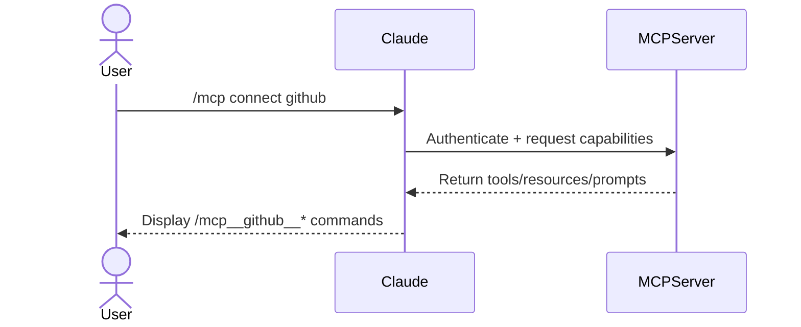
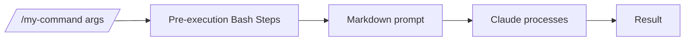
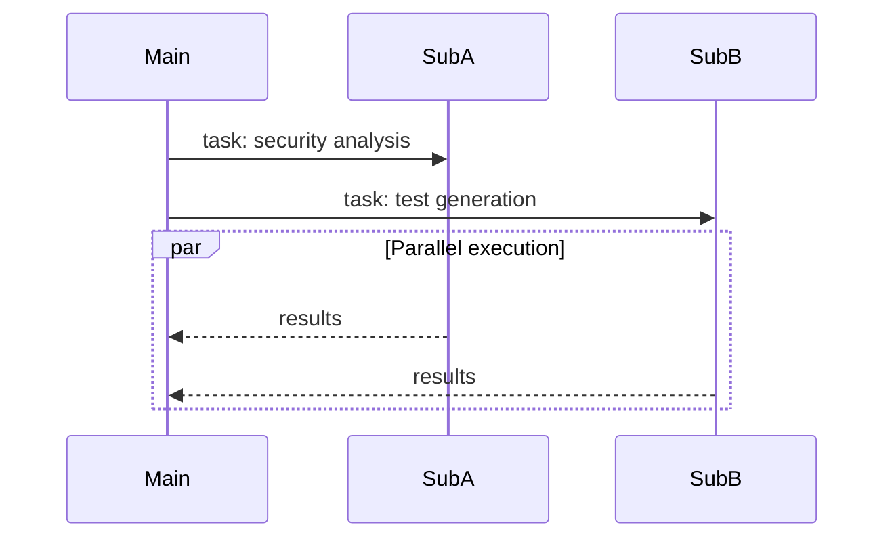
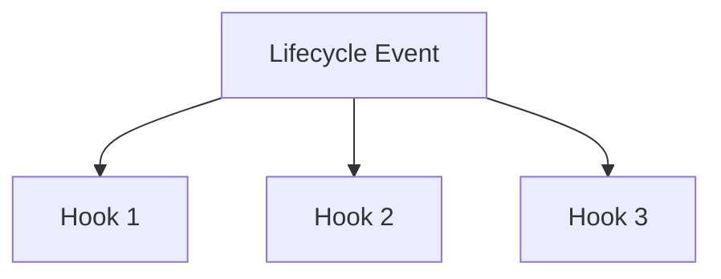
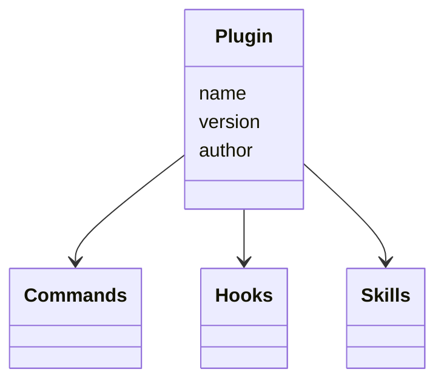
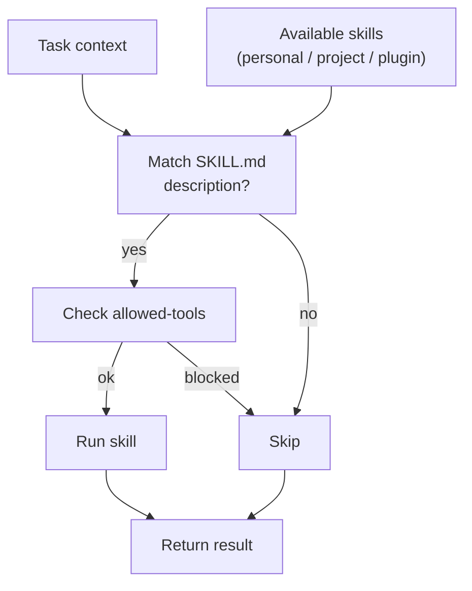

# Understanding Claude Code's Full Stack: MCP, Skills, Subagents, and Hooks Explained

import Alert from "@components/Alert.astro";
import Aside from "@components/Aside.astro";
import FileTree from "@components/FileTree.astro";
import Figure from "@components/Figure.astro";
import TLDR from "@components/TLDR.astro";
import InternalLink from "@components/InternalLink.astro";
import claudeSenpai from "@assets/images/claude-code/claudesenpai.png";
import claudeMd from "@assets/images/claude-code/claudeMd.png";

I've been using Claude Code for months. Mostly for quick edits and generating boilerplate. The vibe coding tool everyone talks about.

Then I actually explored what it could do. MCP servers. Slash commands. Plugins. Skills. Hooks. Subagents. CLAUDE.md files.

I was blown away. Claude Code isn't just a coding assistant. It's a framework for orchestrating AI agents. It speeds up development in ways I've never seen before.

Most people use one or two features. They miss how these features stack together. This guide explains each concept **in the order they build on each other** — from external connections to automatic behaviors. (New to using LLMs for development? Start with my <InternalLink slug="how-i-use-llms">overview of how I use LLMs</InternalLink> for context.)

> Claude Code is, with hindsight, poorly named. It's not purely a coding tool: it's a tool for general computer automation. Anything you can achieve by typing commands into a computer is something that can now be automated by Claude Code. It's best described as a general agent. Skills make this a whole lot more obvious and explicit.
>
> — Simon Willison, [Claude Skills are awesome, maybe a bigger deal than MCP](https://simonwillison.net/2025/Oct/16/claude-skills/)

<TLDR
  items={[
    "CLAUDE.md files give Claude project memory and context",
    "Slash commands are user-triggered, repeatable workflows",
    "Subagents handle parallel work in isolated contexts",
    "Hooks automatically react to lifecycle events",
    "Plugins bundle commands, hooks, and skills for sharing",
    "MCP connects external tools through a universal protocol",
    "Skills activate automatically based on task context",
  ]}
/>

## The feature stack

1. **Model Context Protocol (MCP)** — the foundation for connecting external tools and data sources
2. **Claude Code core features** — project memory, slash commands, subagents, and hooks
3. **Plugins** — shareable packages that bundle commands, hooks, and skills
4. **Agent Skills** — automatic, model-invoked capabilities that activate based on task context

<Figure
  src={claudeSenpai}
  caption="Claude Senpai knows all the features!"
  alt="Robot Claude Senpai with a knowing expression"
  size="medium"
/>

---

## 1) Model Context Protocol (MCP) — connecting external systems



**What it is.** The <InternalLink slug="what-is-model-context-protocol-mcp">Model Context Protocol</InternalLink> connects Claude Code to external tools and data sources. Think universal adapter for GitHub, databases, APIs, and other systems.

**How it works.** Connect an MCP server, get access to its tools, resources, and prompts as slash commands:

```bash
# Install a server
claude mcp add playwright npx @playwright/mcp@latest

# Use it
/mcp__playwright__create-test [args]
```

<Alert type="caution" title="Context Window Management">
  Each MCP server consumes context. Monitor with `/context` and remove unused
  servers.
</Alert>

**The gotcha.** MCP servers expose their own tools — they don't inherit Claude's Read, Write, or Bash unless explicitly provided.

**Real-world example.** Want to see MCP in action? Check out how to <InternalLink slug="building_ai_qa_engineer_claude_code_playwright">build an AI QA engineer with Playwright MCP</InternalLink> that tests your app like a real user.

---

## 2) Claude Code core features

### 2.1) Project memory with `CLAUDE.md`

**What it is.** Markdown files Claude loads at startup. They give Claude memory about your project's conventions, architecture, and patterns.

**How it works.** Files merge hierarchically from enterprise → user (`~/.claude/CLAUDE.md`) → project (`./CLAUDE.md`). When you reference `@components/Button.vue`, Claude also reads CLAUDE.md from that directory and its parents.

**Example structure for a Vue app:**

<FileTree
  tree={[
    {
      name: "my-vue-app",
      open: true,
      children: [
        {
          name: "CLAUDE.md",
          comment: "Project-wide conventions, tech stack, build commands",
        },
        {
          name: "src",
          open: true,
          children: [
            {
              name: "components",
              open: true,
              children: [
                {
                  name: "CLAUDE.md",
                  comment: "Component patterns, naming conventions, prop types",
                },
                { name: "Button.vue" },
                { name: "Card.vue" },
              ],
            },
            {
              name: "pages",
              open: true,
              children: [
                {
                  name: "CLAUDE.md",
                  comment: "Routing patterns, page structure, data fetching",
                },
                { name: "Home.vue" },
                { name: "About.vue" },
              ],
            },
          ],
        },
      ],
    },
  ]}
/>

When you work on `src/components/Button.vue`, Claude loads context from:

1. Enterprise CLAUDE.md (if configured)
2. User `~/.claude/CLAUDE.md` (personal preferences)
3. Project root `CLAUDE.md` (project-wide info)
4. `src/components/CLAUDE.md` (component-specific patterns)

**What goes in.** Common commands, coding standards, architectural patterns. Keep it concise — reference guide, not documentation. Need help creating your own? Check out this [CLAUDE.md creation guide](/prompts/claude/claude-create-md).

Here's my blog's CLAUDE.md:

````markdown
# CLAUDE.md

## Project Overview

Alexander Opalic's personal blog built on AstroPaper - Astro-based blog theme with TypeScript, React, TailwindCSS.

**Tech Stack**: Astro 5, TypeScript, React, TailwindCSS, Shiki, FuseJS, Playwright

## Development Commands

```bash
npm run dev              # Build + Pagefind + dev server (localhost:4321)
npm run build            # Production build
npm run lint             # ESLint for .astro, .ts, .tsx
---
```
````

### 2.2) Slash Commands — explicit, reusable prompts



**What they are.** Markdown files in `.claude/commands/` you trigger manually by typing `/name [args]`. User-controlled workflows.

**Key features:**

- `$ARGUMENTS` or `$1`, `$2` for argument passing
- `@file` syntax to inline code
- `allowed-tools: Bash(...)` for pre-execution scripts
- <InternalLink slug="xml-tagged-prompts-framework-reliable-ai-responses">
    XML-tagged prompts
  </InternalLink>
  for reliable outputs

**When to use.** Repeatable workflows you trigger on demand — code reviews, commit messages, scaffolding. For a complete example of a git workflow built entirely with slash commands, see my <InternalLink slug="claude-code-slash-commands-guide">Slash Commands Guide</InternalLink>. Want to create your own? Use this [slash command creation guide](/prompts/claude/claude-create-command).

**Example structure:**

```markdown
---
description: Create new slash commands
argument-hint: [name] [purpose]
allowed-tools: Bash(mkdir:*), Bash(tee:*)
---

# /create-command

Generate slash command files with proper structure.

**Inputs:** `$1` = name, `$2` = purpose
**Outputs:** `STATUS=WROTE PATH=.claude/commands/{name}.md`

[... instructions ...]
```

Commands can create commands. Meta, but powerful.

---

### 2.3) Subagents — specialized AI personalities for delegation



**What they are.** Pre-configured AI personalities with specific expertise areas. Each subagent has its own system prompt, allowed tools, and separate context window. When Claude encounters a task matching a subagent's expertise, it delegates automatically.

**Why use them.** Keep your main conversation clean while offloading specialized work. Each subagent works independently in its own context window, preventing token bloat. Run multiple subagents in parallel for concurrent analysis.

<Alert type="tip" title="Avoiding Context Poisoning">
  Subagents prevent "context poisoning" — when detailed implementation work
  clutters your main conversation. Use subagents for deep dives (security
  audits, test generation, refactoring) that would otherwise fill your primary
  context with noise.
</Alert>

**Example structure:**

```markdown
---
name: security-auditor
description: Analyzes code for security vulnerabilities
tools: Read, Grep, Bash # Controls what this personality can access
model: sonnet # Optional: sonnet, opus, haiku, inherit
---

You are a security-focused code auditor.

Identify vulnerabilities (XSS, SQL injection, CSRF, etc.)
Check dependencies and packages
Verify auth/authorization
Review data validation

Provide severity levels: Critical, High, Medium, Low.
Focus on OWASP Top 10.
```

The system prompt shapes the subagent's behavior. The `description` helps Claude know when to delegate. The `tools` restrict what the personality can access.

**Best practices:** One expertise area per subagent. Grant minimal tool access. Use `haiku` for simple tasks, `sonnet` for complex analysis. Run independent work in parallel. Need a template? Check out this [subagent creation guide](/prompts/claude/claude-create-agent).

---

### 2.4) Hooks — automatic event-driven actions



**What they are.** JSON-configured handlers in `.claude/settings.json` that trigger automatically on lifecycle events. No manual invocation.

**Available events:** `PreToolUse`, `PostToolUse`, `UserPromptSubmit`, `Notification`, `Stop`, `SubagentStop`, `SessionStart`

**Two modes:**

- **Command:** Run shell commands (fast, predictable)
- **Prompt:** Let Claude decide with the LLM (flexible, context-aware)

**Example:** Auto-lint after file edits.

```json
{
  "hooks": {
    "PostToolUse": [
      {
        "matcher": "Edit|Write",
        "hooks": [
          {
            "type": "command",
            "command": "\"$CLAUDE_PROJECT_DIR\"/.claude/hooks/run-oxlint.sh"
          }
        ]
      }
    ]
  }
}
```

```bash
#!/usr/bin/env bash
file_path="$(jq -r '.tool_input.file_path // ""')"

if [[ "$file_path" =~ \.(js|jsx|ts|tsx|vue)$ ]]; then
  pnpm lint:fast
fi
```

**Common uses:** Auto-format after edits, require approval for bash commands, validate writes, initialize sessions. For a practical example, see how to <InternalLink slug="claude-code-notification-hooks">set up desktop notifications</InternalLink> when Claude needs your attention. Want to create your own hooks? Use this [hook creation guide](/prompts/claude/claude-create-hook).

---

## 3) Plugins — shareable, packaged configurations



**What they are.** Distributable bundles of commands, hooks, skills, and metadata. Share your setup with teammates or install pre-built configurations.

**Basic structure:**

<FileTree
  tree={[
    {
      name: "my-plugin",
      open: true,
      children: [
        {
          name: ".claude-plugin",
          open: true,
          children: [
            { name: "plugin.json", comment: "Manifest: name, version, author" },
          ],
        },
        { name: "commands", children: [{ name: "greet.md" }] },
        {
          name: "skills",
          children: [{ name: "my-skill", children: [{ name: "SKILL.md" }] }],
        },
        { name: "hooks", children: [{ name: "hooks.json" }] },
      ],
    },
  ]}
/>

**When to use.** Share team configurations, <InternalLink slug="building-my-first-claude-code-plugin">package domain workflows</InternalLink>, distribute opinionated patterns, install community tooling.

**How it works.** Install a plugin, get instant access. Components merge seamlessly — hooks combine, commands appear in autocomplete, skills activate automatically. Ready to build your own? Check out this [plugin creation guide](/prompts/claude/claude-create-plugin).

---

## 4) Agent Skills — automatic, task-driven capabilities



**What they are.** Folders with `SKILL.md` descriptors plus optional scripts. Unlike slash commands, skills activate **automatically** when their description matches the task context.

**How Claude discovers them.** When you give Claude a task, it reviews available skill descriptions to find relevant ones. If a skill's `description` field matches the task context, Claude loads the full skill instructions and applies them. This happens transparently — you never explicitly invoke skills.

<Alert type="info" title="Official Example Skills">
  Check out the [official Anthropic skills
  repository](https://github.com/anthropics/skills) for ready-to-use examples.
</Alert>

> Claude Skills are awesome, maybe a bigger deal than MCP
>
> — Simon Willison, [Claude Skills are awesome, maybe a bigger deal than MCP](https://simonwillison.net/2025/Oct/16/claude-skills/)

<Alert type="tip" title="Advanced Skills: Superpowers Library">
Want rigorous, spec-driven development? Check out [obra's superpowers](https://github.com/obra/superpowers) — a comprehensive skills library that enforces systematic workflows.

**What it provides:** TDD workflows (RED-GREEN-REFACTOR), systematic debugging, code review processes, git worktree management, and brainstorming frameworks. Each skill pushes you toward verification-based development instead of "trust me, it works."

**The philosophy:** Test before implementation. Verify with evidence. Debug systematically through four phases. Plan before coding. No shortcuts.

These skills work together to prevent common mistakes. The brainstorming skill activates before implementation. The TDD skill enforces writing tests first. The verification skill blocks completion claims without proof.

**Use when:** You want Claude to be more disciplined about development practices, especially for production code.

</Alert>

**Where to put them:**

- `~/.claude/skills/` — personal, all projects
- `.claude/skills/` — project-specific
- Inside plugins — distributable

**What you need:**

- `SKILL.md` with frontmatter (`name`, `description`)
- Optional `allowed-tools` declaration
- Optional helper scripts

Want to create your own skill? Use this [skill creation guide](/prompts/claude/claude-create-skill).

**Why they're powerful.** Skills package expertise Claude applies automatically. Style enforcement, doc updates, test hygiene, framework patterns — all without manual triggering.

**Skills vs CLAUDE.md.** Think of skills as modular chunks of a CLAUDE.md file. Instead of Claude reviewing a massive document every time, skills let Claude access specific expertise only when needed. This improves context efficiency while maintaining automatic behavior.

**Key difference.** Skills are "always on." Claude activates them based on context. Commands require manual invocation.

<Alert type="caution" title="Skills vs Commands: The Gray Area">
Some workflows could be either a skill or a command. Example: git worktree management.

**Make it a skill if:** You want Claude to automatically consider git worktrees whenever relevant to the conversation.

**Make it a command if:** You want explicit control over when worktree logic runs (e.g., `/create-worktree feature-branch`).

The overlap is real — choose based on whether you prefer automatic activation or manual control.

</Alert>

<Alert type="info" title="Automatic vs Manual Triggering">
**Subagents and Skills activate automatically** when Claude determines they're relevant to the task. You don't need to invoke them manually — Claude uses them proactively when it thinks they're useful.

**Slash commands require manual triggering** — you type `/command-name` to run them.

This is the fundamental difference: automation vs explicit control.

</Alert>

---

## Putting it all together

Here's how these features work together in practice:

1. **Memory (`CLAUDE.md`)** — Establish project context and conventions that Claude always knows
2. **Slash commands** — Create explicit shortcuts for workflows you want to trigger on demand
3. **Subagents** — Offload parallel or isolated work to specialized agents
4. **Hooks** — Enforce rules and automate repetitive actions at key lifecycle events
5. **Plugins** — Package and distribute your entire setup to others
6. **MCP** — Connect external systems and make their capabilities available as commands
7. **Skills** — Define automatic behaviors that activate based on task context

### Example: A Task-Based Development Workflow

Here's a real-world workflow that combines multiple features:

**Setup phase:**

- `CLAUDE.md` contains implementation standards ("don't commit until I approve", "write tests first")
- `/load-context` slash command initializes new chats with project state
- `update-documentation` skill activates automatically after implementations
- Hook triggers linting after file edits

**Planning phase (Chat 1):**

- Main agent plans bug fix or new feature
- Outputs detailed task file with approach

**Implementation phase (Chat 2):**

- Start fresh context with `/load-context`
- Feed in the plan from Chat 1
- Implementation subagent executes the plan
- `update-documentation` skill updates docs automatically
- `/resolve-task` command marks task complete

**Why this works:** Main context stays focused on planning. Heavy implementation work happens in isolated context. Skills handle documentation. Hooks enforce quality standards. No context pollution.

## Decision guide: choosing the right tool

<Alert type="info" title="Quick Reference Cheat Sheet">
  For a comprehensive visual guide to all Claude Code features, check out the
  [Awesome Claude Code Cheat Sheet](https://awesomeclaude.ai/code-cheatsheet).
</Alert>

<Alert type="tip" title="Customize Your Terminal">
  Want model name, context usage, and cost displayed in your terminal? See how to <InternalLink slug="customize_claude_code_status_line">customize your Claude Code status line</InternalLink>.
</Alert>

<Aside type="tip" title="Quick Reference">

- **Use `CLAUDE.md`** to define lasting project context — architecture, conventions, and patterns Claude should always remember. Best for: static knowledge that rarely changes.
- **Use <InternalLink slug="claude-code-slash-commands-guide">Slash Commands</InternalLink>** for explicit, repeatable workflows you want to trigger manually. Best for: workflow automation, user-initiated actions.
- **Use Subagents** when you need parallel execution or want to isolate heavy computational work. Best for: preventing context pollution, specialized deep dives.
- **Use Hooks** to automatically enforce standards or react to specific events. Best for: quality gates, automatic actions tied to tool usage.
- **Use Plugins** to package and share complete configurations across teams or projects. Best for: team standardization, distributing opinionated setups.
- **Use MCP** to integrate external systems and expose their capabilities as native commands. Best for: connecting databases, APIs, third-party tools.
- **Use Skills** for automatic, context-driven behaviors that should apply without manual invocation. Best for: automated context provision, "always on" expertise.

</Aside>

### Feature comparison

<Alert type="info" title="Source">
  This comparison table is adapted from [IndyDevDan's video "I finally CRACKED
  Claude Agent Skills"](https://www.youtube.com/watch?v=kFpLzCVLA20&t=1027s).
</Alert>

| Category            | Skill | MCP     | Subagent | Slash Command |
| ------------------- | ----- | ------- | -------- | ------------- |
| Triggered By        | Agent | Both    | Both     | Engineer      |
| Context Efficiency  | High  | Low     | High     | High          |
| Context Persistence | ✅    | ✅      | ✅       | ✅            |
| Parallelizable      | ❌    | ❌      | ❌       | ❌            |
| Specializable       | ✅    | ✅      | ✅       | ✅            |
| Sharable            | ✅    | ✅      | ✅       | ✅            |
| Modularity          | High  | High    | Mid      | Mid           |
| Tool Permissions    | ✅    | ❌      | ✅       | ✅            |
| Can Use Prompts     | ✅    | ✅      | ✅       | ✅            |
| Can Use Skills      | ✅    | Kind of | ✅       | ✅            |
| Can Use MCP Servers | ✅    | ✅      | ✅       | ✅            |
| Can Use Subagents   | ✅    | ✅      | ✅       | ❌            |

### Real-world examples

| Use Case                                               | Best Tool     | Why                                                  |
| ------------------------------------------------------ | ------------- | ---------------------------------------------------- |
| "Always use Pinia for state management in Vue apps"    | `CLAUDE.md`   | Persistent context that applies to all conversations |
| Generate standardized commit messages                  | Slash Command | Explicit action you trigger when ready to commit     |
| Check Jira tickets and analyze security simultaneously | Subagents     | Parallel execution with isolated contexts            |
| Run linter after every file edit                       | Hook          | Automatic reaction to lifecycle event                |
| Share your team's Vue testing patterns                 | Plugin        | Distributable package with commands + skills         |
| Query PostgreSQL database for reports                  | MCP           | External system integration                          |
| <InternalLink slug="how-i-use-claude-code-for-doing-seo-audits">Run automated SEO audits with browser testing</InternalLink> | MCP | External system integration |
| Detect style guide violations during any edit          | Skill         | Automatic behavior based on task context             |
| Create React components from templates                 | Slash Command | Manual workflow with repeatable structure            |
| "Never use `any` type in TypeScript"                   | Hook          | Automatic enforcement after code changes             |
| Auto-format code on save                               | Hook          | Event-driven automation                              |
| Connect to GitHub for issue management                 | MCP           | External API integration                             |
| Run comprehensive test suite in parallel               | Subagent      | Isolated, resource-intensive work                    |
| Deploy to staging environment                          | Slash Command | Manual trigger with safeguards                       |
| <InternalLink slug="custom-tdd-workflow-claude-code-vue">Enforce TDD workflow automatically</InternalLink> | Skill | Context-aware automatic behavior |
| Initialize new projects with team standards            | Plugin        | Shareable, complete configuration                    |
